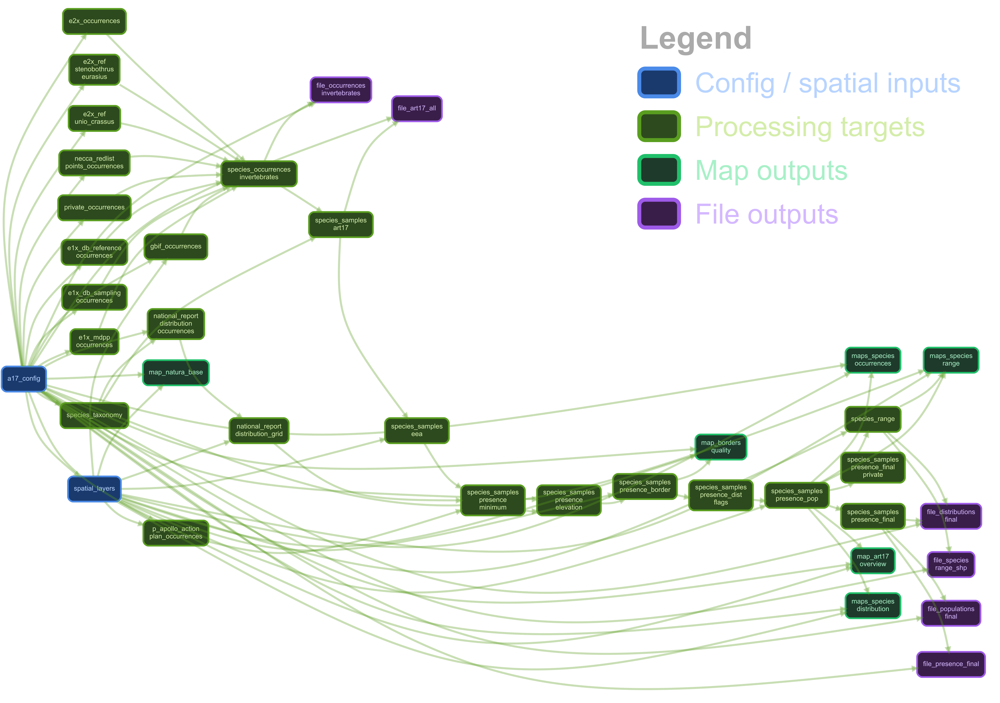

# Invertebrate monitoring pipeline — Greece, Article 17

> 🇬🇷 [Διαβάστε αυτό στα ελληνικά](README_GR.md)

Analysis and reporting pipeline for the monitoring of invertebrates under the
Natura 2000 Species Directive (Article 17, Directive 92/43/EEC), reporting
period 2019–2024. Funded by the Natural Environment & Climate Change Agency
(NECCA/ΟΦΥΠΕΚΑ), October 2024 – July 2025.

The pipeline integrates occurrence data from 10 sources, enriches records with
spatial layers (EEA grids, Natura 2000, EU DEM), applies species-specific
quality filters, computes range estimates, and produces the tabular and
cartographic outputs required for the EU Art. 17 assessment.

## Contents

* [Workflow](#workflow)
* [Data inputs](#data-inputs)
* [Outputs](#outputs)
* [Species list](#species-list)
* [Software](#software)
* [Licence](#licence)

**Detailed user guides:**
[English wiki](WIKI_EN.md) · [Ελληνικό εγχειρίδιο](WIKI_GR.md)

---

## Workflow

### 1. Setup

Clone the repository and restore the R environment:

```bash
git clone https://github.com/savvas-paragkamian/necca_epopteia.git
cd necca_epopteia
```

```r
renv::restore()
```

All package versions are pinned in `renv.lock`. The `.Rprofile` activates
`renv` automatically on startup.

#### Container (recommended for full reproducibility)

```bash
podman build -t myproj-rgeo:4.5.3 -f .devcontainer/Containerfile .

podman run --rm -it \
    --userns=keep-id \
    -v "$PWD":/workspaces/project:Z \
    myproj-rgeo:4.5.3
```

The full pipeline peaks at ~3.6 GiB RAM and runs in ~6.5 min on a single core.
Ensure the podman machine has enough headroom:

```bash
podman machine stop
podman machine set --memory 6144 --cpus 4
podman machine start
```

#### Resource usage (benchmark, single core, full run from scratch)

| Metric | Value |
|--------|-------|
| Wall clock time | 6 min 25 s |
| User CPU time | 6 min 6 s |
| Peak RAM (RSS) | 3.57 GiB |
| Peak memory footprint | 189 MiB |

User ≈ real time indicates near-single-threaded execution. Run with
`tar_make(par_type = "future")` to parallelise the Extract targets.

### 2. Configuration

All input and output file paths are declared in `config/params.yml`. No paths
are hardcoded in the R source files.

### 3. Running the pipeline

The pipeline is implemented with the `{targets}` package. The full
Extract → Transform → Load chain runs in a single command:

```r
targets::tar_make()
```

Targets caches each intermediate result. Only outdated targets re-run when
inputs change. Other useful commands:

```r
targets::tar_visnetwork()          # visualise the dependency graph
targets::tar_read(species_range)   # inspect any cached target
targets::tar_outdated()            # list targets that need to re-run
targets::tar_make(par_type = "future")  # parallel execution
```

### 4. Pipeline structure

The pipeline consists of 38 targets across three phases.

```
┌─ Extract ──────────────────────────────────────────────────────────────────┐
│  a17_config · spatial_layers · species_taxonomy                            │
│  10 × read_*_occurrences() targets (run independently)                     │
└────────────────────────────────────────────────────────────────────────────┘
           │
           ▼
┌─ Transform ────────────────────────────────────────────────────────────────┐
│  national_report_distribution_grid                                         │
│  species_occurrences_invertebrates                                         │
│    → species_samples_art17 → species_samples_eea                           │
│    → species_samples_presence_minimum                                      │
│    → species_samples_presence_elevation                                    │
│    → species_samples_presence_border                                       │
│    → species_samples_presence_dist_flags                                   │
│    → species_samples_presence_pop                                          │
│    → species_samples_presence_final / _final_private                       │
└────────────────────────────────────────────────────────────────────────────┘
           │
           ▼
┌─ Load ─────────────────────────────────────────────────────────────────────┐
│  Maps:    map_borders_quality · map_natura_base · map_art17_overview       │
│           maps_species_occurrences · maps_species_range                    │
│           maps_species_distribution · file_species_range_shp               │
│  TSVs:    file_occurrences_invertebrates · file_art17_all                  │
│           file_presence_final · file_distributions_final                   │
│           file_populations_final                                           │
└────────────────────────────────────────────────────────────────────────────┘
```



The R functions implementing each phase live in the `R/` directory:

| File | Phase | Role |
|------|-------|------|
| `extract_occurrences.R` | Extract | One reader function per data source |
| `extract_spatial.R` | Extract | Loads spatial reference layers |
| `helper_functions.R` | Preparation / Extract / Transform | Spatial utilities (range expansion, raster extraction); GBIF download helpers; one-time raster preparation tools (crop EU DEM to Greece); taxonomic name verification against CoL, WoRMS, GBIF and EOL (output requires manual curation) |
| `transform.R` | Transform | All enrichment, filtering and flag-assignment functions |
| `load_maps.R` | Load | Map generation per species and overview maps |
| `load_official_outputs.R` | Load | TSV writers for official Art. 17 reporting files |
| `qc.R` | QC | Quality control (stub — under development) |

---

## Data preparation

Before running the pipeline for the first time, three one-time preparation steps
are required. Helper functions in `R/helper_functions.R` cover all three.

### Downloading GBIF occurrences

GBIF credentials must be stored in `~/.Renviron` (`GBIF_USER`, `GBIF_PWD`,
`GBIF_EMAIL`). Run interactively in R:

```r
source("R/helper_functions.R")
source("R/extract_occurrences.R")

# Resolve species names → GBIF taxon keys
keys <- get_gbif_taxon_keys(species_names_combined)

# Submit download request (returns a download key)
key <- request_gbif_download(keys, country = "GR")

# Wait for completion and save (can take several minutes)
import_gbif_download(key, output_path = "data/raw/gbif_invertebrate_species_occ.tsv")
```

Or as a single call:

```r
download_gbif_occurrences(
  species_names = species_names_combined,
  output_path   = "data/raw/gbif_invertebrate_species_occ.tsv"
)
```

### Cropping large rasters to Greece

The full EU DEM mosaic (~20 GB, EPSG:3035) must be cropped to Greece before the
pipeline can use it. The cropped file is what `config/params.yml` points to.

```r
source("R/helper_functions.R")
source("R/extract_spatial.R")

greece_regions <- sf::st_read("data/spatial/gadm41_GRC_shp/gadm41_GRC_2.shp")

crop_eu_dem_to_greece(
  eu_dem_path    = "/path/to/full/eudem_dem_3035_europe.tif",
  greece_regions = greece_regions,
  output_path    = "data/spatial/EU_DEM_mosaic_5deg_gr/crop_eudem_dem_3035_europe.tif"
)
```

For any other large raster (WorldClim, CORINE, etc.) use the general function:

```r
crop_raster_to_extent(
  raster_path = "/path/to/source.tif",
  extent_sf   = greece_regions,
  output_path = "data/spatial/output/cropped.tif",
  target_crs  = 3035   # NULL to keep source CRS
)
```

### Taxonomic name verification

Species names must be verified against authoritative databases and manually
curated before the pipeline can use them. This produces
`data/raw/species_taxonomy_curated.tsv`, which is the taxonomy input for the
pipeline.

> **Note:** this step requires human review — the output is not used directly
> by the pipeline but feeds manual curation of the taxonomy file.

```r
source("R/helper_functions.R")

verify_species_taxonomy(
  species_names = species_names_combined,
  output_path   = "results/gnr_species_verifier.tsv"
)
```

Names are checked against Catalogue of Life (1), WoRMS (9), GBIF (11) and
EOL (12). After inspecting the matches, update
`data/raw/species_taxonomy_curated.tsv` with the accepted canonical names.

---

## Data inputs

### Occurrence data (`data/raw/`)

| Source | Format | Content |
|--------|--------|---------|
| GBIF | TSV | Occurrences, filtered to Greece, coordinate uncertainty < 1 000 m |
| E1X MDPP 2014–2024 | XLSX | Field monitoring samples |
| E1X DB sampling | XLSX | Structured sampling records |
| E1X DB references | XLSX | Bibliographic reference records |
| E2X DB | TSV | Occurrence database |
| E2X ref — *Unio crassus* complex | XLSX | Supplementary freshwater mussel records |
| E2X ref — *Stenobothrus eurasius* | TSV | Supplementary grasshopper records |
| Private records | CSV | Partner-contributed field records |
| NECCA Redlist | GeoPackage | NECCA redlist point occurrences |
| National report 2013–2018 | SHP | Previous Art. 17 distribution grid (standard + sensitive) |
| *Parnassius apollo* Action Plan 2019 | SHP | Species-specific distribution grid |

All occurrence sources are standardised to Darwin Core column names
(`submittedName`, `decimalLatitude`, `decimalLongitude`, `collectionCode`,
`recordNumber`, `datasetName`, `basisOfRecord`, `individualCount`).

### Spatial reference layers (`data/spatial/`)

| Layer | Format | Use |
|-------|--------|-----|
| Greece administrative boundaries (GADM 4.1) | SHP | Point filtering, border-distance calculation |
| EEA reference grid 1 km | SHP | Population-level assessment |
| EEA reference grid 10 km | SHP | Art. 17 distribution reporting |
| Natura 2000 (v32, 2021) | SHP | Site assignment, background maps |
| EU DEM (ETRS89-LAEA, 3035) | GeoTIFF | Elevation extraction, species-specific altitude filters |

---

## Outputs

All output paths are declared in `config/params.yml`.

| File | Location | Content |
|------|----------|---------|
| `species_occurrences_invertebrates.tsv` | `data/derived/` | All occurrence records combined |
| `species_samples_art17_all.tsv` | `data/derived/` | Records filtered to Annex II species |
| `species_samples_presence_final.tsv` | `results/` | Final presence dataset (no private records) |
| `distributions_presence_final.tsv` | `results/` | Per-species, per-10 km-cell distribution (observed + range) |
| `populations_presence_final.tsv` | `results/` | Per-species, per-1 km-cell population counts |
| `species_range/species_range.shp` | `results/` | Computed range polygons for all species |
| `maps/map_natura.png` | `results/maps/` | Natura 2000 overview map |
| `maps/map_art17_invertebrates_natura.png` | `results/maps/` | All Art. 17 occurrences on Natura 2000 |
| `maps/map_occurrences_borders_filtering.png` | `results/maps/` | QC map: points relative to Greece borders |
| `maps/species_maps/map_*_occurrences.png` | `results/maps/` | Per-species occurrence map |
| `maps/species_maps/map_*_range.png` | `results/maps/` | Per-species range map |
| `maps/species_maps/map_*_distribution.png` | `results/maps/` | Per-species distribution map (sample density) |

---

## Species list

39 invertebrate taxa of Annex II assessed in this pipeline:

*Apatura metis* · *Astacus astacus* · *Austropotamobius torrentium* ·
*Bolbelasmus unicornis* · *Buprestis splendens* · *Catopta thrips* ·
*Cerambyx cerdo* · *Coenagrion ornatum* · *Cordulegaster heros* ·
*Dioszeghyana schmidtii* · *Eriogaster catax* · *Euphydryas aurinia* ·
*Euplagia quadripunctaria* · *Hirudo verbana* · *Hyles hippophaes* ·
*Lindenia tetraphylla* · *Lucanus cervus* · *Lycaena dispar* ·
*Maculinea arion* · *Morimus asper funereus* · *Ophiogomphus cecilia* ·
*Osmoderma eremita* Complex · *Papilio alexanor* ·
*Paracaloptenus caloptenoides* · *Parnassius apollo* · *Parnassius mnemosyne* ·
*Polyommatus eroides* · *Probaticus subrugosus* · *Proserpinus proserpina* ·
*Pseudophilotes bavius* · *Rhysodes sulcatus* · *Rosalia alpina* ·
*Stenobothrus eurasius* · *Stylurus flavipes* · *Unio crassus* ·
*Unio elongatulus* · *Vertigo angustior* · *Vertigo moulinsiana* ·
*Zerynthia polyxena*

---

## Software

R 4.5.3 managed via `renv`. Key packages:

| Package | Version | Role |
|---------|---------|------|
| targets | 1.12.0 | Pipeline orchestration |
| tarchetypes | 0.14.1 | Pipeline helpers |
| sf | 1.0-19 | Vector spatial data |
| terra | 1.8-15 | Raster spatial data |
| dplyr / tidyr / purrr | tidyverse | Data wrangling |
| ggplot2 | 3.5.1 | Mapping |
| readxl | 1.4.3 | Excel ingestion |
| rgbif | 3.8.1 | GBIF data access |
| taxize | 0.10.0 | Taxonomic harmonisation |
| yaml | — | Configuration parsing |

---

## Licence
MIT License

Copyright (c) 2025 Paragkamian, S., Tzortzakaki, O., Goudeli, G., Vourka, A. and Kassara, C., NECCA, Greece

Permission is hereby granted, free of charge, to any person obtaining a copy
of this software and associated documentation files (the "Software"), to deal
in the Software without restriction, including without limitation the rights
to use, copy, modify, merge, publish, distribute, sublicense, and/or sell
copies of the Software, and to permit persons to whom the Software is
furnished to do so, subject to the following conditions:

The above copyright notice and this permission notice shall be included in all
copies or substantial portions of the Software.

THE SOFTWARE IS PROVIDED "AS IS", WITHOUT WARRANTY OF ANY KIND, EXPRESS OR
IMPLIED, INCLUDING BUT NOT LIMITED TO THE WARRANTIES OF MERCHANTABILITY,
FITNESS FOR A PARTICULAR PURPOSE AND NONINFRINGEMENT. IN NO EVENT SHALL THE
AUTHORS OR COPYRIGHT HOLDERS BE LIABLE FOR ANY CLAIM, DAMAGES OR OTHER
LIABILITY, WHETHER IN AN ACTION OF CONTRACT, TORT OR OTHERWISE, ARISING FROM,
OUT OF OR IN CONNECTION WITH THE SOFTWARE OR THE USE OR OTHER DEALINGS IN THE
SOFTWARE.
